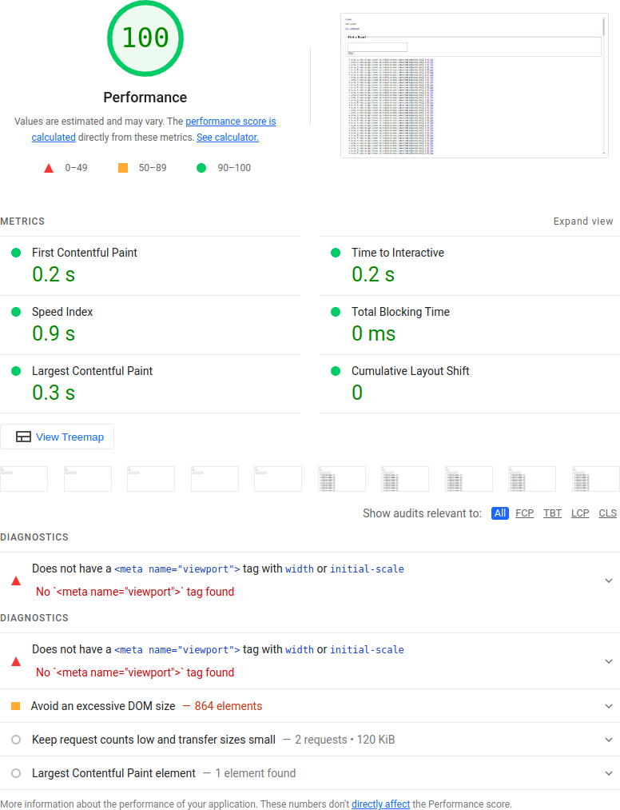
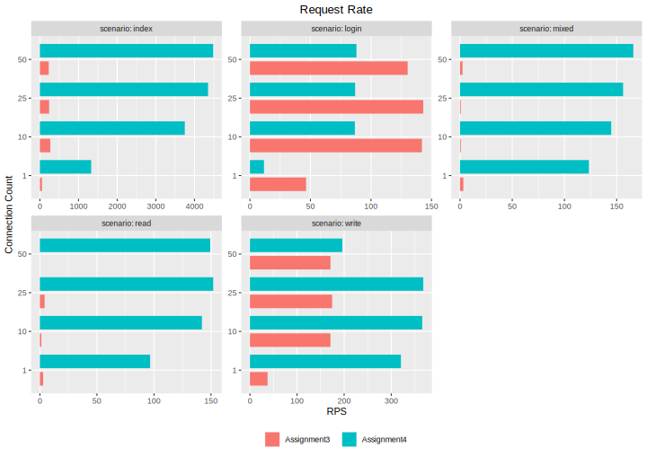
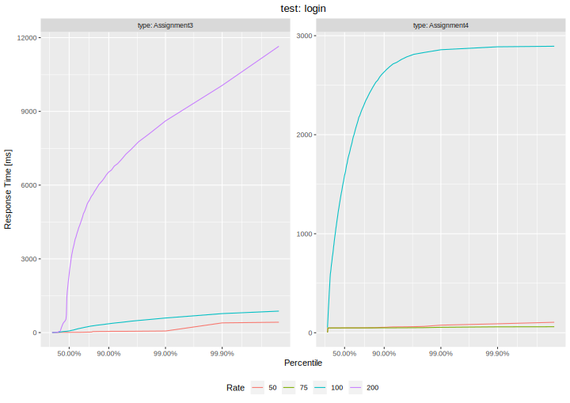
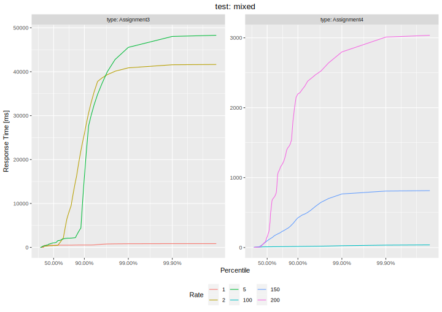

## Lighthouse Performance

Client side performance is tested using the builtin Lighthouse performance test in google chrome. Since both pages do not contain any fancy client side code or design, the performance score is perfect.
The only useful hint is to reduce DOM size in the django case: Here the index page contains all roars, a paging system would be useful once the number of roars grows.

### Django

### Node

## HTTP load tests

Separately, we performed HTTP load tests using [k6](http://k6.io).

For a detailed discussion why we chose k6 and more details about the test setup, see the README.md file in the attached benchmark.zip file.

We conducted five test scenarios: **index** (fetches the index page), **login** (performs a login), **read** (fetches the latest 200 Roars), **write** (posts a roar) and **mixed** (10% posting new Roars, 90% fetching Roars).

### Request Rate results
First, we used a closed model approach where we ran a test using a constant number of VUs which all send requests as fast as they can with a duration of 30 seconds. The request rates we obtain are as follows:

It can easily be deduced that the Node.JS implementation from Assignment 4 generally performs much better than the Assignment 3 Django implementation. In particular, we make the following observations:

* Fetching the index file is much faster for the Node.JS implementation. We assume this is because Python is actually somewhat famous for being quite slow and the additional processing overhead of Django adds on top of that. The Node.JS implementation simply fetches the file from disk and sends it without any further processing. However, compared to a proper performance-oriented web server like nginx, these results are still really low.
* The login process is actually faster for the Django implementation. We're not quite sure why this is the case, maybe it's due to the use of a slower password hashing function (bcrypt instead of pbkdf2)
* read performance is bad for both implementations although the Django implementation is abysmal. For high numbers of connection, we sometimes had request rates below a single request per second. Part of the reason why this is the case might be that the read test fetches up to 200 Roars and of course, transmitting more data takes more time. But this is
also true for the Node.JS implementation and this implementation is not that bad. Part of the difference might be explained by the Django implementation transmitting more data because it sends HTML and not raw data as JSON but even then, this is absurdely low. This is probably not only due to Python being slow and Django having processing overhead but also because of an unoptimized implementation.
* write performance is actually better than read performance. This may be explained by the fact that much less data has to be transmitted (decreasing response times) and also because the SQL queries for inserting data are slightly simpler. Nonetheless, for writes there still are effects like the need for DB synchronization which affects write performane but it's still better than read performance. This is especially the case for the Django implementation which is still behined the Node.JS implementation but nonetheless at least acceptable.
* Performance for the mixed test, as expected, is mostly similar to the read performance but slightly better. This is expected because this test basically only consists of 10% writes and 90% reads so the read performance dominates.

### Latency Percentiles
For Latency Percentiles, we used an open model approach and ran the test using a fixed VU rate, i.e. a fixed number of requests per second (creating new VUs if needed). The rate was chosen based on the Request Rate results.

#### scenario: index

The response time results confirm what the request rate results have shown. Increasing the rate above the limit obtained from the request rate results will lead to high response times. The results for the Node.JS implementation show a strange behaviour we observerd: For the firs 20-25 seconds of the test, the index page was served quite quickly so the users which arrive at a constant rate are served quickly enough so they don't start to queue. However, after these 20-25 seconds, suddenly receiving a response takes much longer which we see as the rapid response time increase in the percentile plot. We're not sure why this is the case but since we use the static files middleware for express, this must be an issue with exress.

In contrast, Django has shows mostly consistent response times, e.g. for 500 RPS more than 50% of all request require more than 1.5s. This is also why the request rate is much lower. This is the behaviour we'd expect and we're not quite sure why node.js with express behaves this erratically.

{width=80%}

#### scenario: login

For the login scenario, the response time curves actually look how we'd expect them too look (no erratic behaviour as for the node.js index test). They confirm our request rate results.

{width=80%}

#### scenario: read

The conclusions from the read results are similar to the ones for the login results. The node.js curves are slightly more erratic again although not as bad as for the index page.

{width=80%}

#### scenario: write

The results for the write test are interesting because we see major response time increases only at around the 90th percentile. We suppose that this is likely due to database locking mechanisms.

{width=80%}

#### scenario: mixed

As the mixed test is a combination of the read and the write test, the results are also similar. The response time curves look similar to the ones for the write test for the lower percentiles (due to them being dominated by the write requests) and the read test for the higher percentiles (due to them being dominated by the read requests).

{width=80%}
