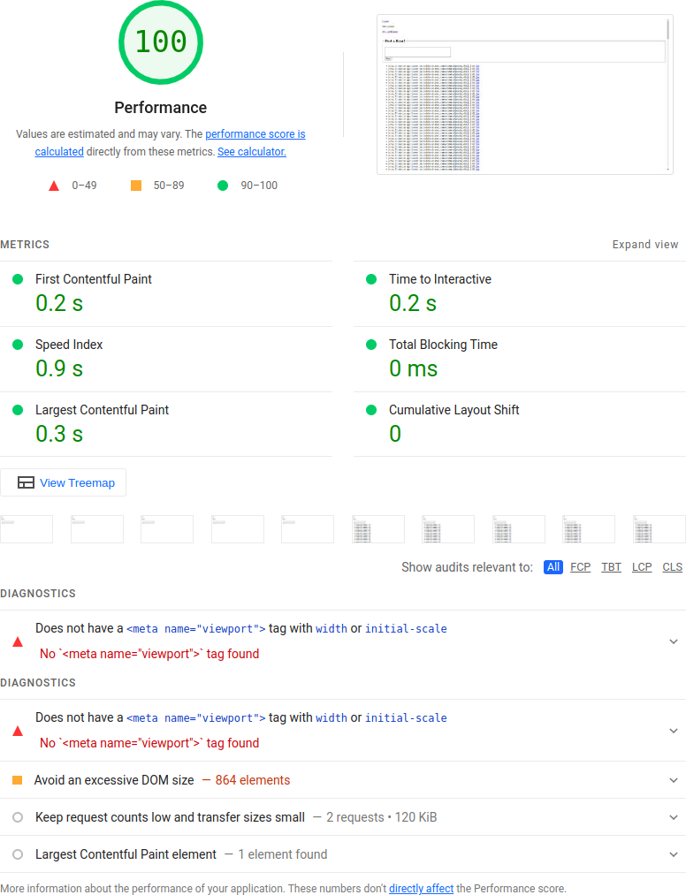
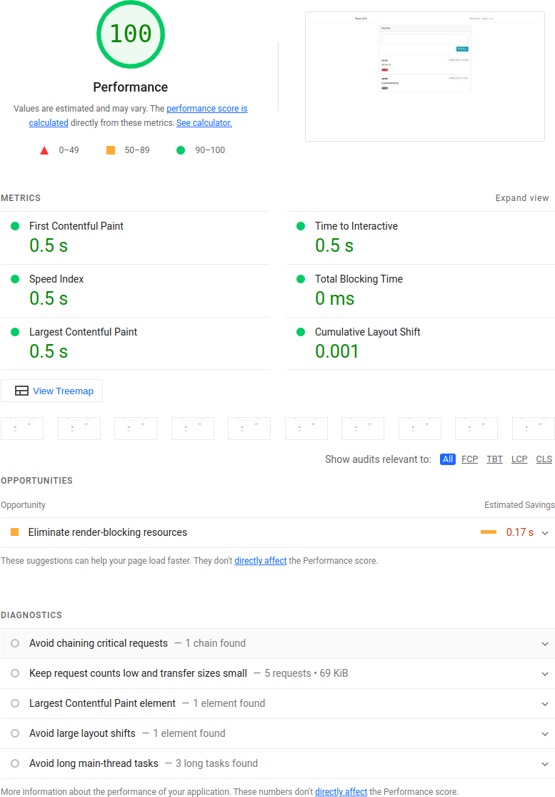

## Client-Side Performance

Client side performance is tested using the builtin Lighthouse performance test in google chrome. Since both pages do not contain any fancy client side code or design, the performance score is perfect.
The only useful hint is to reduce DOM size in the django case: Here the index page contains all roars, a paging system would be useful once the number of roars grows.

### Django

### Node

