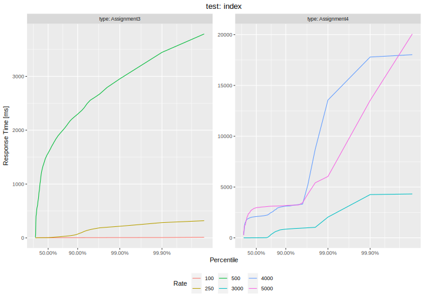
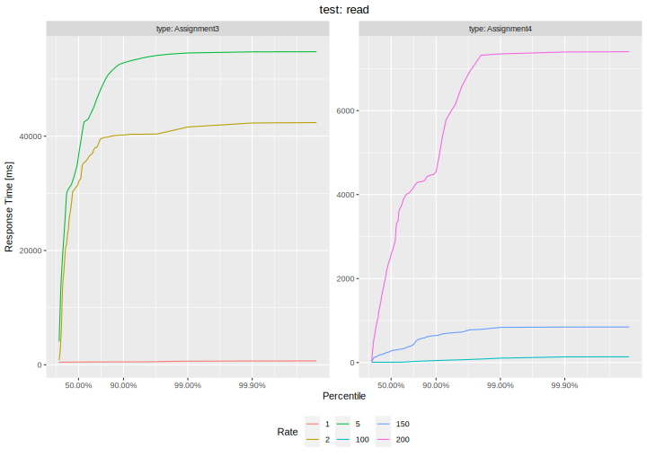
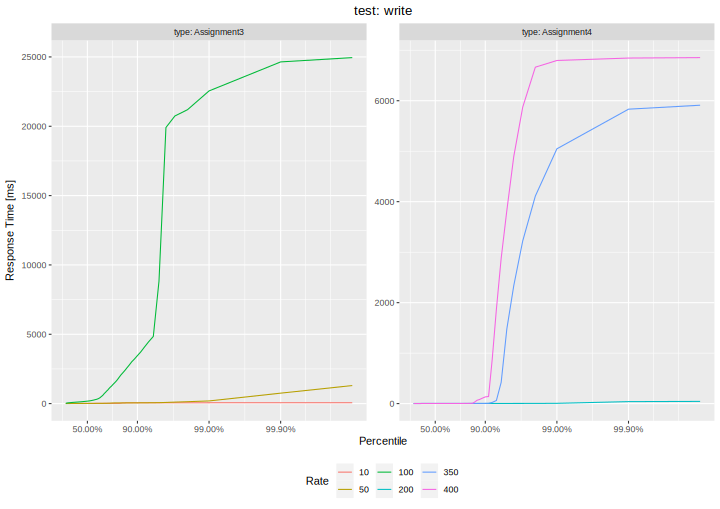
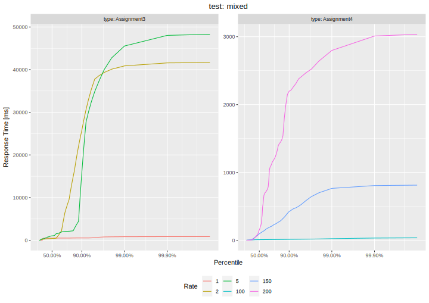

# Assignment 5

## Preface: Load Models and Coordinated Omission
Since one of the Software Projects I conducted was concerned with the evaluation of open source load testing tools I have some experience in this area. I will give a quick motivation and a reason why I chose [k6](https://k6.io) as the load testing tool to conduct these tests.

First and foremost, one of the most important aspects of load testing is that the load test should mirror real user behaviour. Many well-known HTTP benchmarking tools follow a so-called **closed model** approach. To see what this means consider the relation between response times and request rate. Simply put, the average request rate is the reciprocal of the average response time. If a server is under high load, response times will increase. Due to the sequential nature of HTTP where, over a single connection, a client waits for a response before sending the next request, the actual request rate - and thus the generated load - is controlled indirectly by the server via response times.

Now assume a simple load spike, where 1 out of 100 requests takes much longer than all the others. This response time spike wouldn't be seen in a 99th latency percentile, thus omitting problematic behaviour because all subsequent requests get delayed too. This behaviour is called **Coordinated Omission**, *Coordinated* because the load generator implicity coordinates the actual load with the server through response times and *Omission* because it omits problematic behaviour (the delay of subsequent requests).

Of course, a *delay* of subsequent requests requires a notion of an expected point in time where a request is sent. This requires an "execution plan" which determines when requests are sent. The most simple type of such a plan is a constant request rate. A constant rate implies that a request must be finished within a maxmimum response time - the interval between requests. If this is not the case for a request, subsequent requests will be delayed and the overall request rate is not the one we intend.

There are two ways to solve this problem: The first one is **Latency Correction**. This is a simple approach: Just add the delays from the expected send time to the actual response time. However, this is not actually realistic behaviour since in reality, request are still not sent at the expected rate. This may impact server behaviour because a reduced request rate decreases load on the server and may allow it to recover. In reality, users will arrive independent of the server load (the extreme case being DoS attacks). To simulate this behaviour we have to create a new connection and send the request using this connection. This implies that the total number of active connections is variable and driven by response times.

This leads to two broad types of load models: **Closed Models** where we specify a fixed number of connections. The request rate is driven by response times and such tools may suffer from Coordinated Omission. This may be mitigated via Latency Correction but this is still not realistic behaviour. The *wrk2* tool proposed by the assignment is a latency-corrected closed model tool. The other type is **Open Model** tools where we specify a constant request rate and if necessary, new connections are created to compensate for long response times. Since requests will never get delayed this way, there's no need for latency correction.

Lastly, real user behaviour doesn't match both of these types exactly. Most of the times, in reality we have a situation which matches the *open model* scenario in terms of **users**, e.g. users might arrive at a website, click a few links and then leave the website. Thus, we have a scenario where users come at a certain rate (might vary over time), therefore following an open model. However, each user individually follows a closed model. For example, if a user clicks a link, the user must wait for the response before the next link can be clicked (since it's contained in the html response), this implies a closed model.

For this reason, many advanced tools follow an open model in terms of the connection count. A "load profile" in terms of the user rate is specified (e.g. simply a constant rate). Each user then executes a "scenario" which e.g. consists of fetching the main HTML page, then logging in, etc. These users are called "virtual users" and these tools can be called VU-based tools. VU-based tools (in comparison to "benchmarking" tools) are generally more complex so they don't achieve quite the same level of performance, however they offer many convenience features e.g. Cookies (crucial e.g. for session management) and scripting which is essential to define realistic scenarios.

As I stated in the beginning, I conducted a project where multiple open source load testing tools were compared. Given our Roary application, there are some requirements which a load testing tool for Roary requires. Namely, since we use cookies for session management, Cookie support is essential. Second, an open model is desirable since Roary represents a publicly accessible website where users arrive independently of response times. These simple requirements already eliminate a lot of tools. The example tool in the assignment description, *wrk2* can be scripted and with a lot of effort, Cookies can be implemented but this requires extracting the Set-Cookie header and is generally really cumbersome. It's also not an open model tool. 

In my project, I found the best open model tools to be **Gatling** and **k6**. The former one is generally a bit more annoying to set up and also doesn't provide the same amount of detailed metrics. Performace wise, both of them are similar. For this reason I chose *k6* as the tool of choice.

## Folder structure

We conducted our tests for our implementations of Assignment 3 and 4. The folder structure is as follows:

* The **impls** folder simply contains our solutions for Assignments 3 and 4. For Assignment 4, this is
necessary, because we forgot to submit that one... (and for completeness, Assignment 3 is there as well).
* The **db-defaults** folder contains default database files for the tests.
* The **scripts** folder contains test scripts and R scripts for plot generation.
* The **results** folder contains raw *k6* CSV logs and the generated plots.

## Setup for reproducing the results

### Docker setup
* Build and run the container and ensure that this folder is mounted to /tests

    ```console
    docker build -t <NAME> .
    docker run --network=host -v "$(pwd):/tests" -it --rm <NAME>
    ```
* The container opens a console, see the "Running the tests" section below for details how to run the tests
* In theory, for k6, the k6 container provided by grafana (`docker pull grafana/k6`) can also be used but our container
also contains the R environment for generating the plots
* Note that this solution mounts this folder in the container's "/tests" directory, so all results will be available locally too. However, they will all be owned by root. To own them after being done, simply use `chown -R <USER>:<GROUP> .`
* The test scripts accept the host as an argument (k6's "-e" option), *localhost* won't work because that refers to the container's environment. However, using the `--network=host` option as shown above but this will only work on Linux.
Alternatively use a manual setup or use the "host.docker.internal" address (see [here](https://stackoverflow.com/questions/24319662/from-inside-of-a-docker-container-how-do-i-connect-to-the-localhost-of-the-mach)). Even better is executing the load generator and the target on different machines and then use proper host names or IP adresses.

### Manual setup

* Install k6 as described [here](https://k6.io/docs/getting-started/installation/)
* Note the "Troubleshooting" section below, sometimes there is an error because of a missing gpg directory which is not created by default
* Aditionally, for plot generation, install R and the R tidyverse package. Easiest is using a package manager, e.g. using `apt install r-base r-cran-tidyverse`
    
### Running the tests

In general, for both assignments we provide the following test parameters:

* **HOST**: Specifies the target host (e.g. "localhost:8080")
* **MODE**: *count* (run a fixed number of requests), *duration* (run for a fixed number of time) and *rate* (run a fixed request rate). The former two follow a closed model and we only use the duration test in order to determine the maximum request rate the server can handle. The rate test follows an open model and ensures the specified request rate. This should be used for latency measurements due to the reasons explained above.
* **SCENARIO**: *index*, *login*, *read*, *write* or *mixed*. *index* simply fetches the index page, *login* performs logins, *read* fetches 200 Roars from the server, *write* posts a Roar, and *mixed* combines *read* and *write* such that every tenth request is a write and all others are reads.
* **DURATION**: The test duration in seconds (only for *rate* and *duration* modes)
* **COUNT**: The number of requests (only for the *count* mode)
* **RATE**: The request rate (only for *rate* mode)
* **VUS**: The number of constant VUs (only for *count* and *duration* modes)

All of these parameters are mandatory except if not used by a mode (e.g. *COUNT* being only used in *count* mode). These test parameters are passed using k6's `-e` flag, e.g. `-e MODE=count`. Apart from these test parameters, there are some additional k6 flags which we'll use. In general, an running a test is done something like this:

```console
k6 run \
    --out csv=./results/raw/<LOG_NAME>.csv \
    # --http-debug=headers oder --http-debug=full, optional for debug output
    -e HOST=<HOST> \
    -e MODE=<MODE> -e SCENARIO=<SCENARIO> \
    -e DURATION=<DUR> -e COUNT=<CNT> \
    -e RATE=<RATE> -e VUS=<VUS> \
    ./scripts/tests/Assignment<X>.js
```

Note, before running, the target should be reset into a comparable state. The easiest way to do this is by running the Roary implementations in a Docker container and resetting this container. Alternatively, with a manual setup, restarting the server process and resetting persistent data is also acceptable. For Roary, the only persistent types of data is the database file for which we provide defaults. 

In particular, for Assignment 4, we provide *mixed-read.db* and *write-login.db*. The first one is intended for the mixed and read scenarios and contains a bunch of sample Roars so that the dbms actually has to do something. The second one only contains pre-defined users but no Roars. For Assignment 4, the database file must be copied to the "data" folder in the "node/roary" directory and must be renamed to *roary.db*. For Assignment 3, this is similar: The database file must be copied to the "roar" folder (where "manage.py" is located) and must be renamed to "db.sqlite3".

For executing the test, we provide a convencience script  *gen-plots.sh* inside the scripts folder which executs one test at a time and prompts for an input before contiinuing. Resetting the target server to an initial state must still be done manually. This script can be used as follows:

```console
./scripts/run-tests.sh <A3-HOST> <A4-HOST>
```

Here, `A3-HOST` and `A4-HOST` must be the host and port numbers for the target servers of Assignment 3 and 4 (e.g. "localhost:8000" and "localhost:8001").

### Generating the plots

We provide two scripts for generating plots. The first one creates a bar chart showing the average request rate for *duration* test by scenario and VU count. To create this plot, one must run the *rps.R* script and pipe a CSV file to its stdin with three columns *type*, *scenario* *count* and *file*. The first column is either "Assignment3" or "Assignment4", the second column is a scenario, the third column is the constant number of VUs which was used and the last column is a path to the k6 log file for those parameters. The script generates an SVG file and outputs it to stdout. For example, the script can be used something like this:

```console
echo "type,scenario,count,file
Assignment3,index,10,../results/raw/Assignment3-index-u10-d30.csv
Assignment4,index,10,../results/raw/Assignment4-index-u10-d30.csv
" | Rscript --vanilla ./plots/rps.R > "../results/plots/rps.svg" 2>/dev/null
```

The second script generates a latency percentile plot by VU rate and Assignment type (different scenarios are intended to be display in separate plots). The usage is similar but here, there's no *scenario* column and the *count* column becomes the *rate* column. Aditionally, the script accepts a command line argument to specify the plot title. E.g. this could something like this:

```console
echo "type,rate,file
Assignment3,50,../results/raw/Assignment3-login-r50-d30.csv
Assignment4,50,../results/raw/Assignment4-login-r50-d30.csv
" | Rscript --vanilla ./plots/latency.R "login test" > "../results/plots/latency-login.svg" 2>/dev/null
```

Assuming the convenience script for running the test was used and each of the tests in that script executed sucessfully, another convenience script can be used to generate plots from the CSV results. This convenience script is the *gen-plots.sh* script in the scripts folder and it can simply be invoked without any parameters:

```console
./scripts/gen-plots.sh
```

## Performance Results

We ran all our tests on the same machine. This is obviously not ideal but sufficient for this assignment.

### Request Rate results
First, we used an closed model approach where we ran a test using a constant number of VUs which all send as fast as they can with a duration of 30 seconds. The request rates we obtain are as follows:


It can easiliy be deduced that the Node.JS implementation from Assignment 4 generally performs much better than the Assignment 3 implementation. In particular, we make the following observations:

* Fetching the index file is much faster for the Node.JS implementation. We assume this is because Python is actually somewhat famous for being quite slow and the additional processing overhead of Django adds on top of that. The Node.JS implementation simply fetches the file from disk and sends it without any further processing. However, compared to a proper performance-oriented web server like nginx, these results are still really low.
* The login process is actually faster for the Django implementation. We're not quite sure why this is the case, maybe it's due to the use of a slower password hashing function (bcrypt instead of pbkdf2)
* read performance is bad for both implementations although the Django implementation is abysmal. For high numbers of connection, we sometimes had request rates below a single request per second. Part of the reason why this is the case might be that the read test fetches up to 200 Roars and of course, transmitting more data takes more time. But this is
also true for the Node.JS implementation and this implementation is not that bad. Part of the difference might be explained by the Django implementation transmitting more data because it sends HTML and not raw data as JSON but even then, this is absurdely low. This is probably not only due to Python being slow and Django having processing overhead but also because of an unoptimized implementation.
* write performance is actually better than read performance. This may be explained by the fact that much less data has to be transmitted (decreasing response times) and also because the SQL queries for inserting data are slightly simpler. Nonetheless, for writes there still are effects like the need for DB synchronization which affects write performane but it's still better than read performance. This is especially the case for the Django implementation which is still behined the Node.JS implementation but nonetheless at least acceptable.
* Performance for the mixed test, as expected, is mostly similar to the read performance but slightly better. This is expected because this test basically only consists of 10% writes and 90% reads so the read performance dominates.

### Latency Percentiles
For Latency Percentiles, we used an open model approach and ran the test using a fixed VU rate, i.e. a fixed number of requests per second (creating new VUs if needed). The rate was chosen based on the Request Rate results.

#### scenario: index


The response time results confirm what the request rate results have shown. Increasing the rate above the limit obtained from the request rate results will lead to high response times. The results for the Node.JS implementation show a strange behaviour we observerd: For the firs 20-25 seconds of the test, the index page was served quite quickly so the users which arrive at a constant rate are served quickly enough so they don't start to queue. However, after these 20-25 seconds, suddenly receiving a response takes much longer which we see as the rapid response time increase in the percentile plot. We're not sure why this is the case but since we use the static files middleware for express, this must be an issue with exress.

In contrast, Django has shows mostly consistent response times, e.g. for 500 RPS more than 50% of all request require more than 1.5s. This is also why the request rate is much lower. This is the behaviour we'd expect and we're not quite sure why node.js with express behaves this erratically.

#### scenario: login


For the login scenario, the response time curves actually look how we'd expect them too look (no erratic behaviour as for the node.js index test). They confirm our request rate results.

#### scenario: read


The conclusions from the read results are similar to the ones for the login results. The node.js curves are slightly more erratic again although not as bad as for the index page.

#### scenario: write


The results for the write test are interesting because we see major response time increases only at around the 90th percentile. We suppose that this is likely due to database locking mechanisms.

#### scenario: mixed


As the mixed test is a combination of the read and the write test, the results are also similar. The response time curves look similar to the ones for the write test for the lower percentiles (due to them being dominated by the write requests) and the read test for the higher percentiles (due to them being dominated by the read requests).
