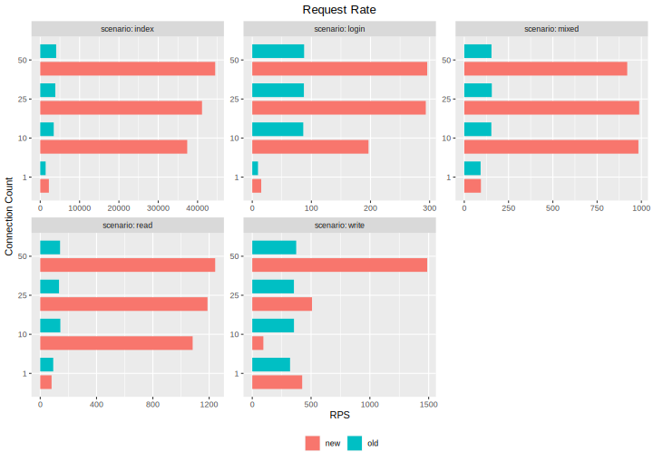
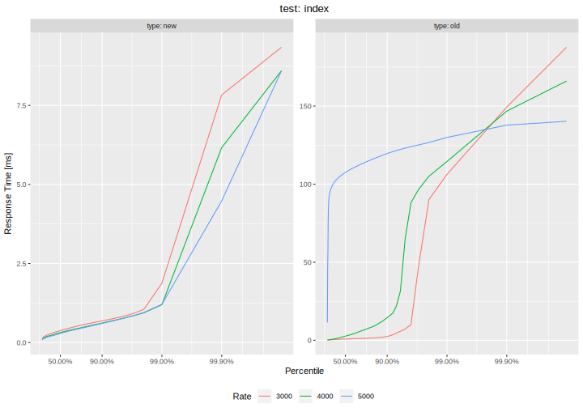
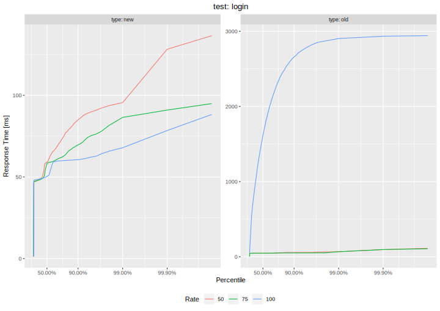
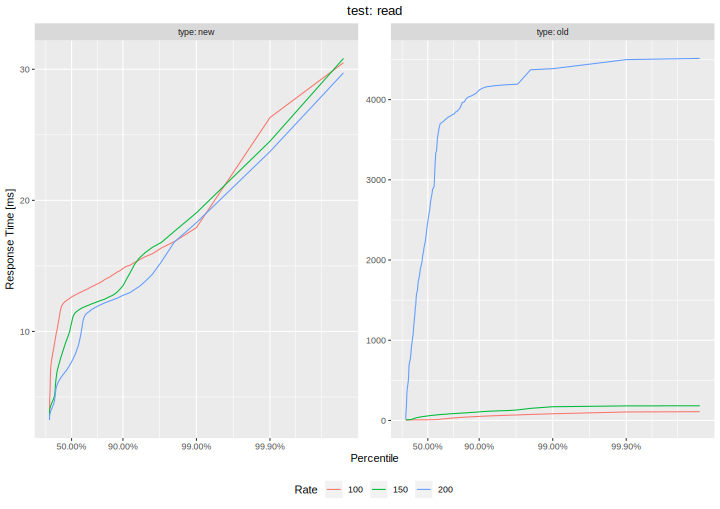
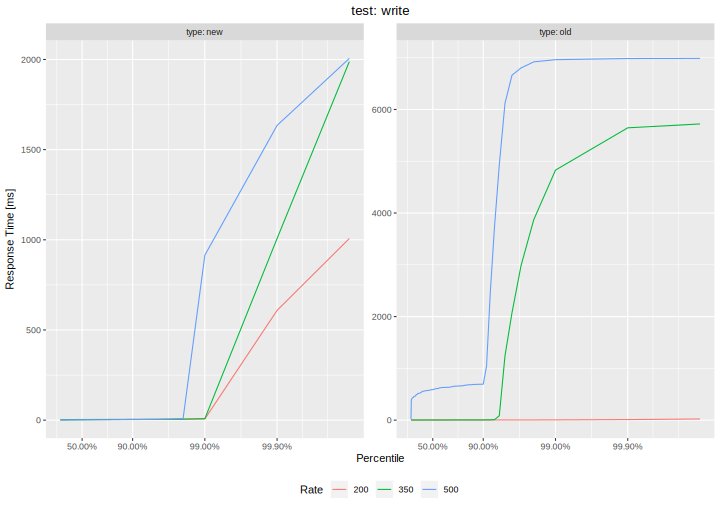
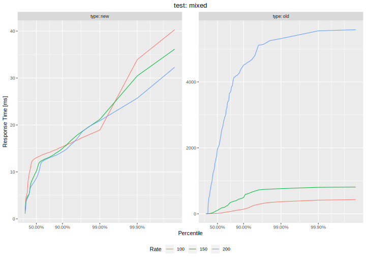

# Assignment 6

## Setup

### Docker setup
* Setup via Docker

    ```console
    docker build -t <NAME> .
    docker run -it --rm -p 8080:80 <NAME>
    ```
* Website available under `http://localhost:8080`

### Manual setup

1. Install node.js (including npm) and nginx which will be used to server static files and act
as a reverse proxy in order to loadbalance requests to multiple Roary instances. Aditionally,
redis is required for sharing session management data. Install e.g. via:

    ```console
    curl -fsSL https://deb.nodesource.com/setup_18.x | sudo -E bash -
    apt install nodejs nginx redis
    ```

2. Inside the *node* folder, a single Roary instance can be run using `npm start`. However, we're going to run multiple instances of Roary in order to enable higher throughput (because Node.js is single-threaded). We use the *pm2* process manager for this. In order to install all dependencies and the *pm2* process manager, run e.g.:

    ```console
    cd node
    npm install
    npm install -g pm2
    ```

3. The index HTML file is to be served statically by nginx, so copy it into the appropriate folder:

    ```console
    mkdir -p /var/www/roary-public
    cp -R -d node/public /var/www/roary-public/
    ```

4. Change the nginx configuration to the *roary* configuration inside the *nginx* folder. Do this as follows:

    ```console
    cp nginx/roary /etc/nginx/sites-available/roary
    rm /etc/nginx/sites-enabled/*
    ln -s /etc/nginx/sites-available/roary /etc/nginx/sites-enabled/roary
    nginx -s reload
    ```
    
    Note, depending on the OS config, nginx might not have started (especially without
    systemd installation, e.g. in docker containers, no nginx process is started by default).
    In this case, replace the reload command with:
    
    ```console
    nginx -c "/etc/nginx/nginx.conf"
    ```
    
    This starts the nginx process(es). Also note that the same thing applies to the redis
    server which might also not be start by default. In this case, run
    
    ```console
    redis-server
    ```
    
    This will not run as daemon in the background. If this is desired, just use:

    ```console
    redis-server --daemonize yes
    ```

5. When nginx and the redis server are running, a cluster of Roary instances (starting on port 3500) can be started via:

    ```console
    cd node
    pm2 start process.yml
    ```
    
    Alternatively, we can also use `pm2-runtime` instead of `pm2` which is a drop-in replacement
    for the `node` command, meaning that processes are run in the foreground instead of as daemon.
    Stopping the cluster can be done using `pm2 stop all` or simply with CTRL+C in the former case.
    As stated previously, a single instance can also be run just by using `npm start`.
    
    Nginx acts as reverse proxy to all those instances via port 80, so the website is 
    accessible on `localhost:80`.
    
## Changes to NodeJS Roary implementation from Assignment 4 to achieve "web-scale"

This implementation is mostly based on the implementation for exercise 4 with most changes relating to the implementation of scalability concepts. The only other change apart from this is the user of a faster sqlite library (see [this](https://github.com/JoshuaWise/better-sqlite3/blob/master/docs/benchmark.md) for details).

Conisered and implemented concepts include:

* Concept: **HTTP/2 and WebSockets**, Implemented: **No**

    This would arguably one of the most important concepts to implement for the Roary use case.
    
    HTTP2 can be used to server push the initial messages and also reduces or eliminates a lot of HTTP/1.1 problems. The WebSocket protocol allows for a full-duplex communication which doesn’t follow the request-response cycle imposed by HTTP. This is very useful for a chat application like Roary because it allows to get rid of polling: When the server receives a new post, it simply broadcasts it to all other connected users. This completely eliminates polling and therefore reduces the load on the server a lot. There are multiple reason why this was not implemented (although it is possible).
    
    First, evaluating the performance is a lot harder to do with WebSocket's since messages must be initiated server side and tool support is not as mature as for HTTP. And although HTTP/2 is supported by k6, it's not supported by express which is used as the node.js library.
    
    The second reason is statelessness. A push-based communication model is generally stateful (it's required to remember which messages were pushed) and we chose a stateless approach. It is possible to do this stateless and we did consider implementing this concept via socket.io and achieving statelessness via socket.io-redis but didn’t have enough time
for this (as it would require to completely change the setup and basically start anew).

* Concept: **REST**, Implemented: **Yes**

    The REST concept is implemented. API paths for accessing Roars are resource-oriented and CRUD operations are implemented via HTTP methods.
    
    The main reason for implementing this concept is that it supports a range of other important concepts which are more important such as statelessness, cacheability, etc.
    
* Concept: **statelessness**, Implemented: **Yes**

    The new Roary implementation via Node.js is completely statelss. The only piece of data which would make the application stateful is session data. This was solved using the connect-redis library.
    
    The reason for statelessness is that is allows for much easer scaling, e.g. running multiple instances of the app to support concurrency.
    
* Concept: **Caching**, Implemented: **sort of**

    The Roary application doesn’t actually have much to cache. Write operations are obviously not cacheable so the only read operation – fetching Roars – is the only cacheable operation. However, the data returned can change since new Roars might have been added so some state would have to be maintained in order to indicate a "dirty" cache which goes against statelessness. Therefore this operation is not cached.

    However, what is cached is the static index.html file. The nginx web server which serves this file is configured to return „302 Not Modified“ responses so the browser has to use its cached version of the file.
    
* Concept: **Database Replication**, Implemented: **No**

    Database replication would actually be a very sensible thing to do since the benchmarks will show that write operations are slower and can’t be as easily scaled up to avoid data inconsistencies. An approach with multiple leader databases which are synchronzied regulary would be a good choice here. 

    We did consider this using litesync, a multi-language replication framework for SQLite, however it has some constraints which don’t fit my database schema. Particulary, it doesn’t support auto-increment keys which we use for primary keys. This would generally not be a problem (just use UUID or something like that) but the advantage of this approach is that I can use the primary keys as a sequence number of posts to poll only new posts. Without auto-increment the application would have to maintain an ID counter itself and synchronzie it across instances which is not ideal.
    
    Also, this might be easier using a full-blown DMBS such as PostgreSQL.
    
* Concept: **Database Sharding**, Implemented: **No**

    Sharding would allow multiple databases to exist and therefore avoid problems with too many accesses to a single database. However, this is not easily doable for the Roary app, since there is no easy way to create isolated key spaces, primarily because there is a relation across partitions (the like state of a Roar).
    
* Concept: **Application Replication**, Implemented: **Yes**

    Since the Roary application is stateless, it is easy to create multiple instances for it which solves on of the main problems of the old implementation which isa load too high for a single Node.js process and therefore implicitly adds concurrency since multiple instances can read data simultaneously. Of course this has no real use for writing data since some locking is still required. Database replication would be required for that.

## Performance Results

The testing process was exactly the same as for the previous Assignment, see that one for more details.

### Request Rate results
First, we used an closed model approach where we ran a test using a constant number of VUs which all send as fast as they can with a duration of 30 seconds. The request rates we obtain are as follows:



It can easiliy be deduced that the Node.JS implementation from Assignment 4 generally performs much better than the Assignment 3 implementation. In particular, we make the following observations:

* Fetching the index file is much faster using the new implementation. This is because of the nginx server which is generally very fast and allowed increase the request rate up to a factor of 10 (nginx is extremely performant, as part of another project I managed to achieve more than 400 000 RPS per second but this is not possible in this test setup).
* The login process was also sped up by up to a factor of 3. We can easily see that gains are primarily seen if we have multiple users. This is expected since node.js is single-threaded and our application replication approach effectively allows for proper multiprocessing. The increase is not as large as for other scenarios which is probably because the login process has a large overhead (session creation).
* In terms of requests which aren't handled by nginx, the most significant increase can be seen for the read test where we saw increases up to a factor of six. This is again because application replication allowed for proper multiprocessing and database reads are fast so there's no bottleneck here. The old implementation is marginally faster for a single user, probably due to nginx's loadbalancing overhead.
* write performance also saw an increase although it's much smaller here. This is because even though we have proper multiprocessing with the new implementation, write accesses require synchronization which bottlenecks the application. However, the new implementation is still much better. One oddity is the result for ten concurrent users where the old implementation was faster. This is either an experimental error or alternatively it may be explained by the synchronization overhead.
* Performance for the mixed test, as expected, is mostly similar to the read performance. This is expected because this test basically only consists of 10% writes and 90% reads so the read performance dominates.

### Latency Percentiles
For Latency Percentiles, we used an open model approach and ran the test using a fixed VU rate, i.e. a fixed number of requests per second (creating new VUs if needed). The rate was chosen based on the Request Rate results.

#### scenario: index


The response time results for the index page are interesting because even if we use a request rate comfortable for node.js/express, nginx achieves far better response times which indicates an extremely low processing overhead. A conclusion is that it's sensible to use a proper web server for serving static content.

#### scenario: login


For the login scenarion, we can't see excessive response times for the new implementation which is expected because the new implementation is able to achieve a higher request rate. Nonetheless we can deduce that the login process has quite a high overhead compared to fetching the index page because even the 50th percentile has a 50ms response time.

#### scenario: read


Response times for read results are much better, again because we didn't run into a request rate limit. We can see that the response times are quite low for read requests which is probably due to application replication and probably also because of the faster sqlite library.

#### scenario: write


The write results are the most interesting results because here, the old and new implementations don't differ too much. The most interesting observation about the latency percentiles is that strong response time increases can only be seen at around the 99th percentile. Those requests are probably those that are affected by wait times due to database locking or other synchronization mechanisms.

#### scenario: mixed


As the mixed test is a combination of the read and the write test, the results are also a mixture of the read and write results. The response time curves look mostly similar to the ones for the read results because 90% of all requests are read requests. The 10% write requests don't have such a large impact because of the lower write "pressure" but we can still see a slight effect when considering that the response time numbers are slightly higher for larger percentiles just as it is the case for the write results.
