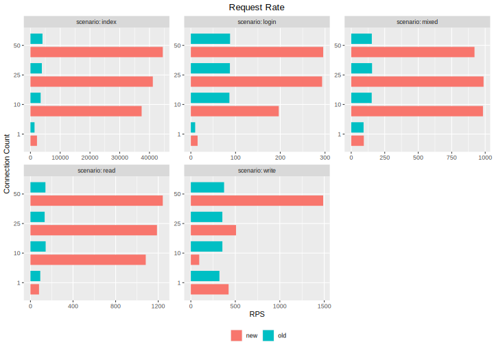
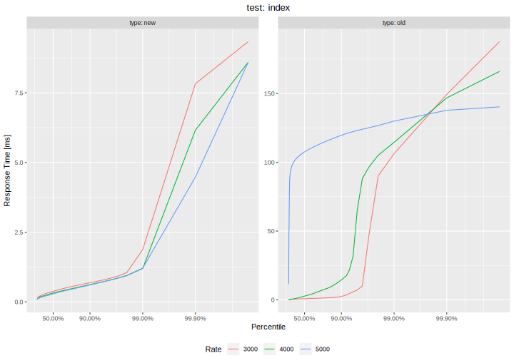
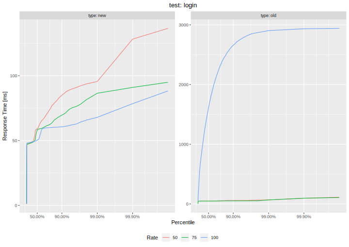
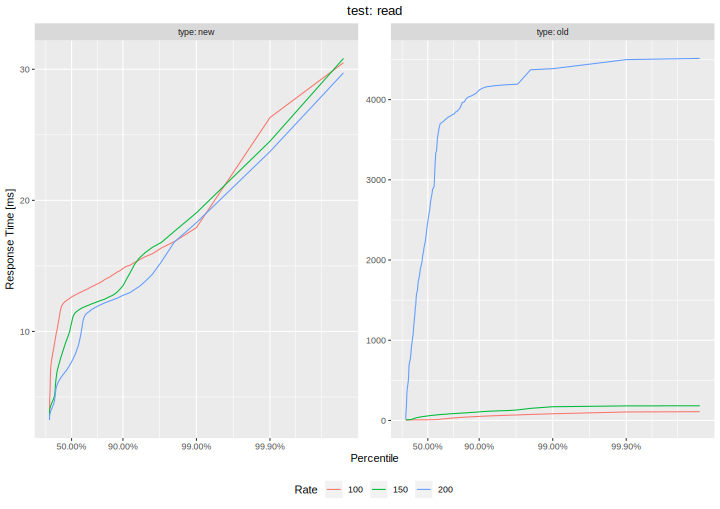
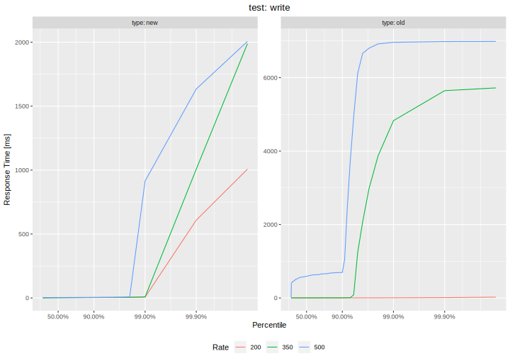
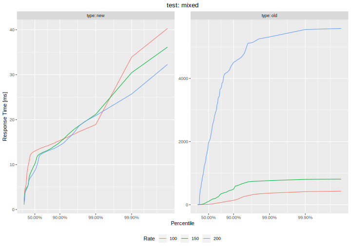

# Assignment 6

For this Assignment we used our Roary implementation for Assignment 4 as a starting point (ignoring the service worker feature). The **benchmarks.zip** file contains our benchmarking setup which is mostly the same as the one we used for Assignment 5 with some small changes to the test scripts. The **roary-old.zip** file contains the old and **roary-new.zip** the new Roary implementation.

In summary, we changed the following parts:

* Application state moved out of process memory into a *Redis* store (session data, no other application state exists)
* Request routes changed to fit a REST model
* [pm2](https://pm2.keymetrics.io/) process manager used to manage node.js instances
* [nginx](https://www.nginx.com/) used as a reverse proxy for load balancing and to serve static files
* Use of [better-sqlite3](https://github.com/JoshuaWise/better-sqlite3/blob/master/docs/benchmark.md) for increased performance
* Use of [WAL mode](https://www.sqlite.org/wal.html) for increased performance

The main evaluation results are:

* The multi-instance approach significantly increase performance, especially read requests
* Moderate improvements for write requests, most likely due to database locking
* Significant speed up for static files

We'll now discuss both aspects in more detail.

## Considered and implemented concepts

### Concept: **HTTP/2 and WebSockets**, Implemented: **No**

This would arguably one of the most important concepts to implement for the Roary use case.
    
HTTP/2 eliminates a lot of HTTP/1.1 problems and the WebSocket protocol allows for a full-duplex communication which doesn’t impose a request-response cycle as HTTP. This is very useful in order to get rid of polling: When the server receives a new post, broadcasts it to all other connected users. This completely eliminates polling and therefore reduces server load a lot. There are multiple reason why this was not implemented (although it is possible).

First, evaluating the performance is a lot harder with WebSocket's since messages must be initiated on the server side and tool support is not as mature as for HTTP. And although HTTP/2 is supported by k6, it's not supported by express.
    
The second reason is statelessness. A push-based communication model is generally stateful (remembering which messages were pushed) and we chose a stateless approach. We considered implementing this concept via socket.io and achieving statelessness using socket.io-redis but didn’t have enough time for this (as it would require to completely change the setup and basically start anew).

### Concept: **REST**, Implemented: **Yes**

We implemented REST by chaning API paths to be resource-oriented and implementing CRUD operations using separate HTTP methods. The main reason for implementing this concept is that it supports a range of other important concepts which are more important such as statelessness, cacheability, etc.
    
### Concept: **statelessness**, Implemented: **Yes**

The new Roary implementation via Node.js is completely statelss. The only state we have is session data which we moved out of the application using the connect-redis library. The reason for statelessness is that is allows for much easer scaling, e.g. running multiple instances of the app to support concurrency.

### Concept: **Caching**, Implemented: **sort of**

The Roary application doesn’t actually have much to cache. Write operations are obviously not cacheable so the only read operation – fetching Roars – is the only cacheable operation. However, the data returned can change since new Roars might have been added so some state would have to be maintained in order to indicate a "dirty" cache which goes against statelessness. Therefore this operation is not cached.

However, what is cached is the static index.html file. The nginx web server which serves this file is configured to return „302 Not Modified“ responses so the browser has to use its cached version of the file.
    
### Concept: **Database Replication**, Implemented: **No**

Database replication would be a sensible improvement since accessing a single database will create a bottleneck sooner or later. We considered using litesync, a multi-language replication framework for SQLite, however it has some constraints which don’t fit our database schema. Particulary, it doesn’t support auto-increment keys which we use for primary keys. This would generally not be a problem (just use UUID or something like that) but the advantage of this approach is that I can use the primary keys as a sequence number of posts to poll only new posts. Without auto-increment the application would have to maintain an ID counter itself and synchronzie it across instances which is not ideal.
    
### Concept: **Database Sharding**, Implemented: **No**

Sharding would allow multiple databases to exist and therefore avoid problems with too many accesses to a single database. However, this is not easily doable for the Roary app, since there is no easy way to create isolated key spaces, primarily because there is a relation across partitions (the like state of a Roar).
    
### Concept: **Application Replication**, Implemented: **Yes**

Since the Roary application is stateless, it is easy to create multiple instances for it which solves on of the main problems of the old implementation which isa load too high for a single Node.js process and therefore implicitly adds concurrency since multiple instances can read data simultaneously. Of course this has no real use for writing data since some locking is still required. Database replication would be required for that.
    
## Evaluation Results

Just as we did for Assignment 5, we conducted five test scenarios: **index** (fetches the index page), **login** (performs a login), **read** (fetches the latest 200 Roars), **write** (posts a roar) and **mixed** (10% posting new Roars, 90% fetching Roars).

### Request Rate results
First, we used a closed model approach where we ran a test using a constant number of VUs which all send requests as fast as they can with a duration of 30 seconds. The request rates we obtain are as follows:

It can easily be deduced that the new, improved implementation generally performs much better than the old implementation. In particular, we make the following observations:

* Fetching the index file is much faster using the new implementation. This is because of the nginx server which is generally very fast and allowed increase the request rate up to a factor of 10 (nginx is extremely performant, as part of another project I managed to achieve more than 400 000 RPS per second but this is not possible in this test setup).
* The login process was also sped up by up to a factor of 3. We can easily see that gains are primarily seen if we have multiple users. This is expected since node.js is single-threaded and our application replication approach effectively allows for proper multiprocessing. The increase is not as large as for other scenarios which is probably because the login process has a large overhead (session creation).
* In terms of requests which aren't handled by nginx, the most significant increase can be seen for the read test where we saw increases up to a factor of six. This is again because application replication allowed for proper multiprocessing and database reads are fast so there's no bottleneck here. The old implementation is marginally faster for a single user, probably due to nginx's loadbalancing overhead.
* write performance also saw an increase although it's much smaller here. This is because even though we have proper multiprocessing with the new implementation, write accesses require synchronization which bottlenecks the application. However, the new implementation is still much better. One oddity is the result for ten concurrent users where the old implementation was faster. This is either an experimental error or alternatively it may be explained by the synchronization overhead.
* Performance for the mixed test, as expected, is mostly similar to the read performance. This is expected because this test basically only consists of 10% writes and 90% reads so the read performance dominates.

### Latency Percentiles
For Latency Percentiles, we used an open model approach and ran the test using a fixed VU rate, i.e. a fixed number of requests per second (creating new VUs if needed). The rate was chosen based on the Request Rate results.

#### scenario: index

The response time results for the index page are interesting because even if we use a request rate comfortable for node.js/express, nginx achieves far better response times which indicates an extremely low processing overhead. A conclusion is that it's sensible to use a proper web server for serving static content.

{width=80%}

#### scenario: login

For the login scenario, we can't see excessive response times for the new implementation which is expected because the new implementation is able to achieve a higher request rate. Nonetheless we can deduce that the login process has quite a high overhead compared to fetching the index page because even the 50th percentile has a 50ms response time.

{width=80%}

#### scenario: read

Response times for read results are much better, again because we didn't run into a request rate limit. We can see that the response times are quite low for read requests which is probably due to application replication and probably also because of the faster sqlite library.

{width=80%}

#### scenario: write

The write results are the most interesting results because here, the old and new implementations don't differ too much. The most interesting observation about the latency percentiles is that strong response time increases can only be seen at around the 99th percentile. Those requests are probably those that are affected by wait times due to database locking or other synchronization mechanisms.

{width=80%}

#### scenario: mixed

As the mixed test is a combination of the read and the write test, the results are also a mixture of the read and write results. The response time curves look mostly similar to the ones for the read results because 90% of all requests are read requests. The 10% write requests don't have such a large impact because of the lower write "pressure" but we can still see a slight effect when considering that the response time numbers are slightly higher for larger percentiles just as it is the case for the write results.

{width=80%}
